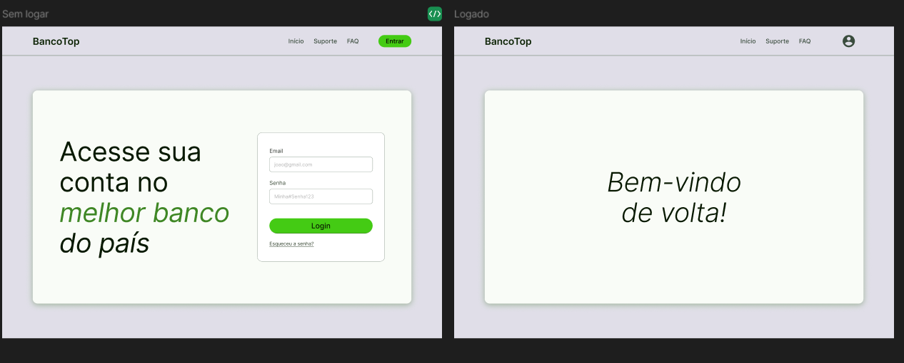
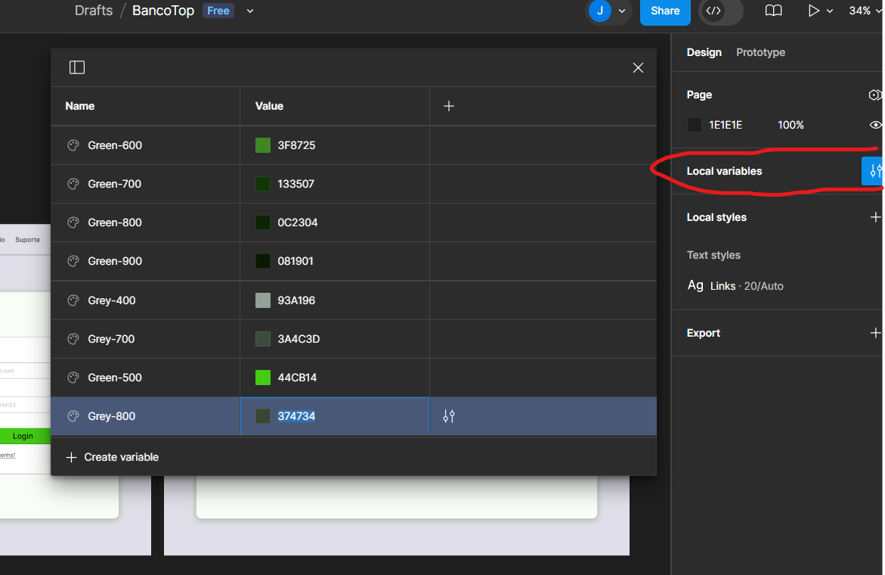

# BancoTop
Objetivos: aprender a utilização de Next.js com Typescript e Tailwindcss
# Instalação inicial
- git clone
- npm install
para desenv -> npm run dev

## Desafio
Bem-vindos ao segundo tech check do mês, dessa vez de Next.js!
Nesse desafio teremos um banco que precisa implementar um sistema bem simples de login. Para isso você deve seguir os dois passos de front-end (feito especialmente pro Mário) e back-end:
1 - Desenvolver a parte de front-end com Tailwind segundo [o design do Figma](https://www.figma.com/design/gB9BBAEcxrXhfxL1XwMkJX/BancoTop?node-id=0-1&t=uNwvWQbEXa5qsioe-1):

Lembre-se de setar [todas as variáveis no tailwind.config.css](https://tailwindcss.com/docs/configuration), duas já estão lá de exemplo

2 - Desenvolver uma API (sem DB) para logar o user (apenas 1 existente, credenciais abaixo) que muda a tela inicial/de login para a segunda tela se ele estiver logado
joao@gmail.com
Minha#Senha123

(opcional) - crie uma função/botão de logout para facilitar o teste se a troca de páginas está funcionando